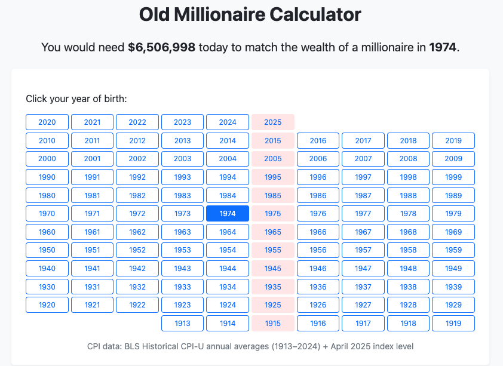

# Old Millionaire

A simple, zero-dependency static web page that tells you how much money you’d need **today** to match the purchasing power of \$1,000,000 in your birth year.

## Features

- **Fixed 10-Column Grid**: A non-responsive year grid shows decades (0–9) in perfectly aligned rows, regardless of screen size.
- **Instant Calculation**: Click a year, and the answer appears immediately—no page reload.
- **Zero Dependencies**: All CPI data and styling are bundled in a single HTML file. No external libraries, frameworks, or API calls.
- **Custom CSS UI**: A clean, modern card layout styled with self-contained CSS.
- **Visual Cues**:
    - Buttons for years ending in “5” get a pale-pink background.
    - The selected year is highlighted in blue.
- **Zero Build Step**: Just open `index.html` in any browser.

## Usage

1. Clone or download the repository.
2. Open `index.html` in your browser.
3. Click the button for your year of birth.
4. Read the result at the top:
   > You would need **\$X** today to match the wealth of a millionaire in **YYYY**.

## Data Source

- Bureau of Labor Statistics, Historical CPI-U annual averages (1913–2024)
- April 2025 CPI-U index level from the latest BLS release

To update the data:

1. Edit the `cpiData` object in the `<script>` section of `index.html`.
2. Add or adjust the year→CPI mappings as published by BLS. The grid will automatically update to reflect the range of years present in the data.

## Customization

- **Adjust styling**: Modify the CSS rules in the `<style>` block of `index.html`.
- **Change highlight years**: Tweak the `.year-btn[data-year$="5"]` selector in the CSS.
- **Extend year range**: Add new key-value pairs to the `cpiData` object in the script. The grid generation is dynamic and will adapt.

## License

This project is released under the MIT License.
Feel free to fork, modify, and redistribute.